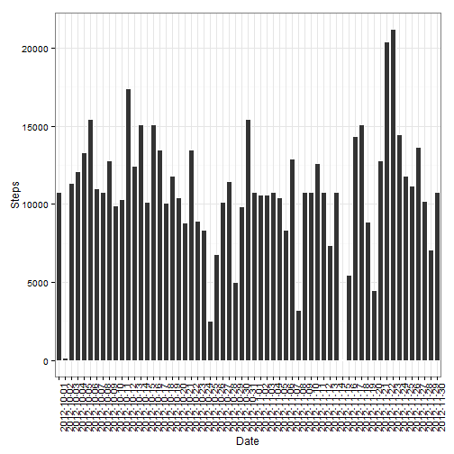
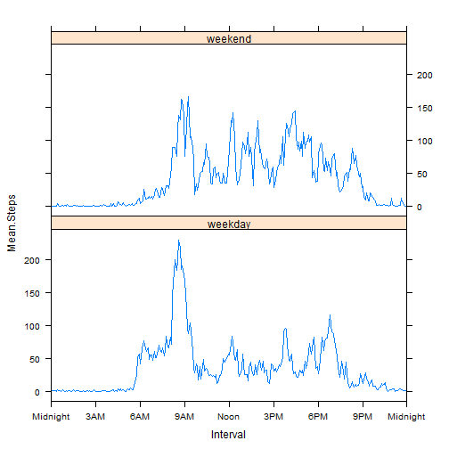

# Reproducible Research: Peer Assessment 1


## Loading and preprocessing the data

```r
require(ggplot2)
```

```
## Loading required package: ggplot2
```

```r
require(scales)
```

```
## Loading required package: scales
```

```r
require(lattice)
```

```
## Loading required package: lattice
```

```r
options(stringsAsFactors = FALSE)
options(scipen=100) 
options(width=100)

kRoot <- "C:/Development/R/Reproducible Research -- Coursera/RepData_PeerAssessment1/"
activity.data <- read.csv(paste(kRoot,"activity/activity.csv",sep=""),header=TRUE)
```

## What is mean total number of steps taken per day?

First, we need to take the raw data and create the daily totals.


```r
bins <- with(activity.data,aggregate(steps,list(date),sum, na.rm=TRUE))
names(bins) <- c("Date","StepSum")
```

Now we can do a histogram. Doing this illustrates why I'm not thrilled about 
this course...you can literally spend hours climbing the learning curve of
ggplot2 and knitr to get it to do what you want. I can make the graphic below 
look fine on the console, but knitr, by default, smashes it into a square, so 
the dates on the x-axis look like crap. I add the scale-x-date to the ggplot 
(uncomment the lines below, and run on the console: it looks great), but knitr 
doesn't understand that Date is of the Date class, and throws an error. 


```r
ggplot(data=bins, aes(x=Date,y=StepSum)) + 
       geom_histogram(binwidth=1, colour="white",stat="identity") +
#       scale_x_date(labels = date_format("%m-%d"),
#                    breaks = seq(min(Date), max(Date), 2)) +
       ylab("Steps") +
       theme_bw() + theme(axis.text.x = element_text(angle=90))
```

 

Remember, we want the mean and median *total* steps taken each day. So we need 
to use the data structure with the daily totals, not the raw data.


```r
mean(bins$StepSum)
```

```
## [1] 9354
```

```r
median(bins$StepSum)
```

```
## [1] 10395
```

## What is the average daily activity pattern?

```r
activity.data$interval <- as.factor(activity.data$interval)
interval.bins <- with(activity.data,aggregate(steps,list(interval),mean, na.rm=TRUE))
names(interval.bins) <- c("Interval","Mean.Steps")
with(interval.bins, {
  plot(Interval,Mean.Steps,type="l",xlab="Interval",ylab="Mean Number of Steps",xaxt = "n")
  axis(1, c(1,37,73,109,145,181,217,253,288), c("Midnight","3AM","6AM","9AM","Noon","3PM","6PM","9PM","Midnight"))
  })
```

 

And at what time (on average) is activity level greatest? Using inline R evaluation:

The maximum average is 206.1698, 
found at 835.

## Imputing missing values

- Number of rows with NA values is:


```r
nrow(subset(activity.data, is.na(steps)))
```

```
## [1] 2304
```

- The strategy for filling NA values will be to use the mean for that interval.
Most likely the device was off, so 0 would be likely be appropriate as well, but
we'll use the mean, since we already have the means from the previous section.

- As Captain Picard would say...*Make it So*:


```r
# I've been at this for an hour or two, so I'm going to be lazy and do this as
# a for-loop, rather than figure out the proper vectorized solution. Bad me.
filled.activity.data <- activity.data
for (i in 1:nrow(filled.activity.data)) {
  if (is.na(filled.activity.data$steps[i])) {
    filled.activity.data$steps[i] <- 
      interval.bins$Mean.Steps[interval.bins$Interval==filled.activity.data$interval[i]]
  }
}
```

- Redo the analysis from the first section, using the filled data set. Different?


```r
filled.bins <- with(filled.activity.data,aggregate(steps,list(date),sum, na.rm=TRUE))
names(filled.bins) <- c("Date","StepSum")
ggplot(data=filled.bins, aes(x=Date,y=StepSum)) + 
       geom_histogram(binwidth=1, colour="white",stat="identity") +
#       scale_x_date(labels = date_format("%m-%d"),
#                    breaks = seq(min(bins$Date), max(bins$Date), 2)) +
       ylab("Steps") +
       theme_bw() + theme(axis.text.x = element_text(angle=90))
```

 

```r
mean(filled.bins$StepSum)
```

```
## [1] 10766
```

```r
median(filled.bins$StepSum)
```

```
## [1] 10766
```

Both mean and median are higher. The oddest thing here is that the median and 
the mean are the *same* (double-checked with summary).

By the way, the apparent missing value in the graph around 15 November is not
a zero, it's approximately 41. On this scale, it appears as nothing.

## Are there differences in activity patterns between weekdays and weekends?


```r
filled.activity.data$Day.Of.Week <- weekdays(as.Date(filled.activity.data$date))
filled.activity.data$Day.Type <- "weekday"
filled.activity.data$Day.Type[filled.activity.data$Day.Of.Week %in% c("Saturday","Sunday")] <- "weekend"
filled.activity.data$Day.Type <- as.factor(filled.activity.data$Day.Type)

weekday.interval.bins <- with(subset(filled.activity.data,Day.Type=="weekday"),
                              aggregate(steps,list(interval),mean))
weekend.interval.bins <- with(subset(filled.activity.data,Day.Type=="weekend"),
                              aggregate(steps,list(interval),mean))
names(weekday.interval.bins) <- c("Interval","Mean.Steps")
names(weekend.interval.bins) <- c("Interval","Mean.Steps")
weekday.interval.bins$Day.Type <- "weekday"
weekend.interval.bins$Day.Type <- "weekend"
filled.interval.bins <- rbind(weekday.interval.bins,weekend.interval.bins)
filled.interval.bins$Day.Type <- as.factor(filled.interval.bins$Day.Type)
```

I can't help but think that was the long way around...

Now, with the weekday/weekend factor set up, all that's left is to 
graph it. I'll try to do it based on the lecture notes this time, rather than
going off the reservation with ggplot2.


```r
xyplot(Mean.Steps ~ Interval | Day.Type, filled.interval.bins, 
       scales=list(x=list(at=c(1,37,73,109,145,181,217,253,288), 
                          labels=c("Midnight","3AM","6AM","9AM","Noon","3PM","6PM","9PM","Midnight"))),
       type="l", layout = c(1,2))
```

 

On weekdays, people definitely seem to prefer working out in the mornings, 
whereas on the weekends, it tends to be more spread through the day.

